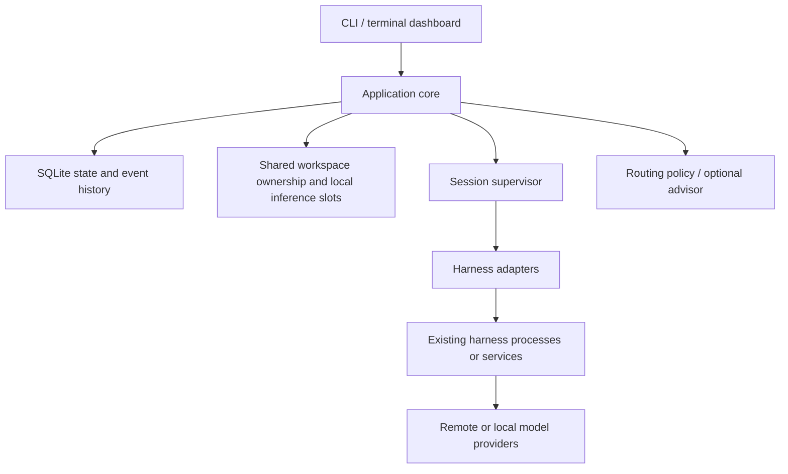

# Minimal architecture

<!-- vigil-status: stage=5.5; stage_accepted=true; implementation_commit=84c0275 -->

Status: Stage 4 specified on 2026-09-20. The [application core specification](core-spec.md), [draft schemas](spec/project.sql), and [implementation backlog/requirement map](stage-5-plan.md) are the detailed contracts. [Linux](research/stage-3/results.md) and [macOS](research/stage-3.5/results.md) runtime findings constrain strict execution.

Implementation status: the offline core described below is implemented and independently accepted through Stage 5.5 at `84c0275`; Stage 5.6 delivery/finalization is next (see [next steps](next-steps.md)). This document remains the design authority and [next steps](next-steps.md) is the implementation-status authority. **Production** execution, model dispatch and delivery remain qualification-gated, so the production half of this architecture is still a design.

## Ownership

The application owns project and plan metadata, task identity, assignment decisions, run history, normalized progress, and visibility into resource usage. Existing harnesses own agent loops, model context, tool execution, and their native permission mechanisms. Local model serving remains external.

The main agent is a configured role running through a harness. Its proposals are inputs to the application's validated commands; the model is not the database or the process supervisor.

## Core concepts

| Concept | Meaning |
| --- | --- |
| Project | Repository or workspace with project-specific configuration |
| Repository | An explicit Git root within a project's repository map, with its own paths, status, and branches |
| Plan | A named objective and related tasks within a project |
| Task | A stable unit of intended work, its requirements, and dependencies |
| Run | One attempt to execute a task; retries and reassignment create distinct attempts |
| Session | A harness-native conversation/execution identity |
| Harness adapter | Integration with an existing agent runtime |
| Model profile | Harness, provider/endpoint, model, capability, and resource configuration |
| Artifact | A result, diff, report, or reference produced by a run |

Task, run, and session are separate: a failed run must not erase the task or earlier evidence. Harness and model are separate: the same harness may serve both local and remote profiles.

Project startup discovers nested repositories and supplies an explicit repository map to agents. Execution uses one dedicated branch per plan per affected repository and reuses it on resume; managed worktrees are deferred. Existing uncommitted changes require an explicit decision and must be preserved. Coordinated multi-repository recovery uses verified checkpoint sets and per-repository progress journals as specified in core-spec.md; implementation remains ahead. Automatic delivery stops at draft MR/PR creation; merging is outside scope.

## Process and storage boundary

Start with one codebase and clear internal packages. Keep UI rendering separate from session supervision. The accepted direction is foreground operation: exiting requests immediate cancellation, and reopening offers native resume where supported or a fresh agent. A background service is not required for the current scope. Persist interrupted state and define recovery independently of background execution.

SQLite stores structured state and an append-only event history. Store large transcripts/artifacts in local files with references from the database. Use a single owner for each project's state while allowing independent project instances. This does not require a distributed event system or full event-sourcing architecture.

A small shared coordination mechanism is accepted for overlapping folder-tree ownership and local inference slots across application instances. Local endpoints default to one active agent, with waiting requests queued. The Stage 4 design selects host-local SQLite coordination, advisory process-owner locks, explicit fencing identities and persistent quarantine; no background agent daemon is required. This mechanism cannot assume control over unmanaged clients or other machines. Reopening the dashboard must query authoritative state rather than infer activity from terminal output.

The first release is terminal-only and manages only sessions it launches. Plan archives remain local and Git-ignored by default. Completion records persist; completed-plan transcripts expire after 30 days by default, with configurable retention and preservation of unfinished recovery context.

## Harness boundary

Adapters should declare capabilities such as start, observe, cancel, resume, steer, usage reporting, and interactive attachment. Unsupported operations remain visible as unsupported. A harness accepting a prompt is distinct from a run completing successfully.

Prefer documented structured interfaces. Terminal scraping is unsuitable as the main source of task status. tmux panes may provide inspection but cannot replace adapter protocols. An RPC session is not automatically attachable to the harness's native interactive UI.

The [initial capability investigation](harness-capabilities.md) recommends Codex app-server over stdio and Hermes TUI gateway over stdio. Model-backed execution, normal interruption, exact completed-session resume, and selected request paths passed on Linux. Abrupt Hermes child cleanup and complete commit/push enforcement did not; unqualified recovery/permission/platform cases remain explicit dispatch gates. Hermes ACP remains an alternative, not a second required implementation.

Disable Hermes crash auto-continuation in application-managed profiles, constrain nested delegation, and account for auxiliary model calls in local-only policy. Keep native permission prompts separate from application grants: unrestricted tools can bypass gated operations unless an effective execution boundary prevents it. Unsupported guarantees must remain visible.

Codex and Hermes are the selected first adapters; Claude Code, pi, and OpenCode follow later. Pin tested harness versions and declare capabilities explicitly. Do not assume a running RPC session can also be controlled through a native terminal UI.

## Routing boundary

Keep policy enforcement separate from any model-based advisor. Eligibility, user overrides, resource constraints, and spending limits remain application concerns. The advisor may suggest which eligible profile fits a task.

[TypeSafe's Jev announcement](https://typesafe.ai/blog/introducing-system-one-models-and-jev) describes typed probabilistic decisions and early access. This makes it a candidate for later routing evaluation, not a foundational dependency. Schema correctness does not establish decision correctness. Its benefit on this project's tasks must be measured, and remote routing must respect whether project content may leave the machine.

Retry/accounting, escalation, scheduling, workspace/checkpoint ownership and completion gates are specified in [core-spec.md](core-spec.md). Implement them in the [Stage 5 slice order](stage-5-plan.md), with production editing gated on a qualified execution boundary.
